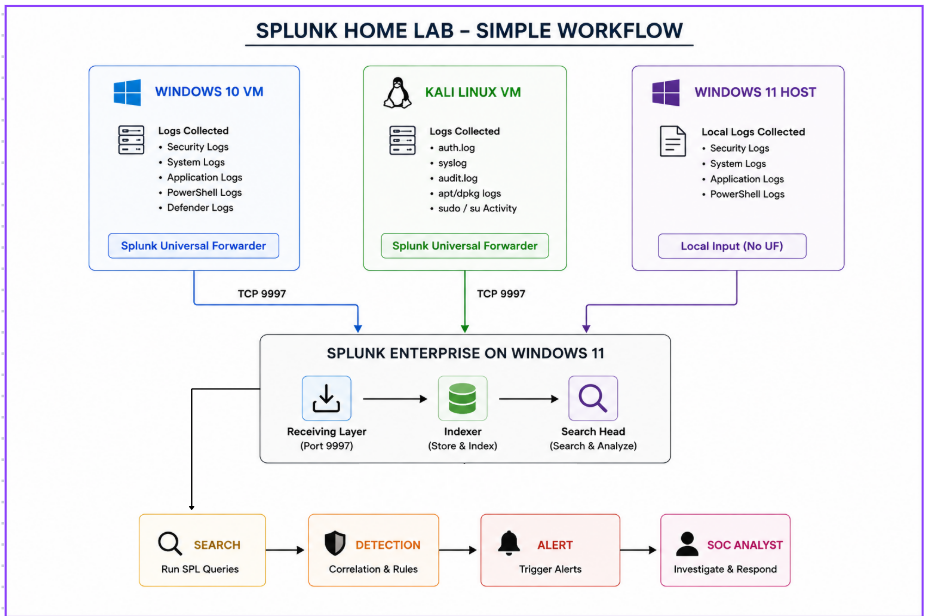
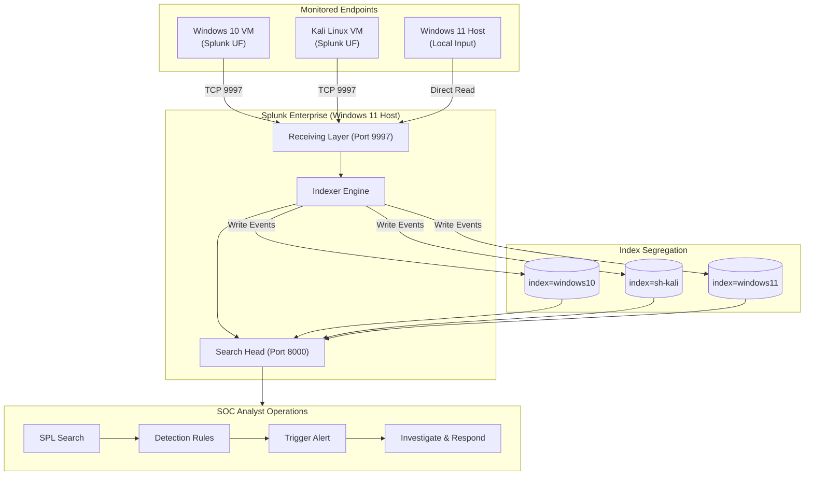

# 🛡️ Splunk SOC Home Lab: Centralized Windows & Linux Security Monitoring

[](https://www.splunk.com/)
[](https://www.microsoft.com/windows)
[](https://www.microsoft.com/windows)
[](https://www.kali.org/)
[](LICENSE)

> A multi-OS Security Operations Center (SOC) laboratory implementing centralized log ingestion, security telemetry forwarding, index segregation, SPL detection engineering, and incident response workflows using **Splunk Enterprise 10.4.2** and **Splunk Universal Forwarders**.

---

## 📸 Executive Summary & Visual Workflow

This repository documents the end-to-end architecture and detection capabilities of a centralized SIEM environment. The Splunk Enterprise server running on a **Windows 11 Host** acts as a central receiving, indexing, search, and alerting engine. Security telemetry is forwarded near real-time over **TCP port 9997** from a **Windows 10 VM** and a **Kali Linux VM**, alongside local Windows 11 host logs.

[](images/workflow_diagram.png)

### 📊 Live Splunk Ingestion Proof
Below is a live search snapshot from the Splunk Enterprise Web interface (`index=*`) verifying **9,435+ events** successfully ingested across all configured indices:

[](images/splunk_search_events.png)

---

## 📋 Table of Contents

- [🛡️ Splunk SOC Home Lab: Centralized Windows \& Linux Security Monitoring](#️-splunk-soc-home-lab-centralized-windows--linux-security-monitoring)
  - [📸 Executive Summary \& Visual Workflow](#-executive-summary--visual-workflow)
    - [📊 Live Splunk Ingestion Proof](#-live-splunk-ingestion-proof)
  - [📋 Table of Contents](#-table-of-contents)
  - [🎯 Objectives \& Project Scope](#-objectives--project-scope)
  - [🏗️ Lab Architecture \& Data Flow](#️-lab-architecture--data-flow)
    - [Mermaid Interactive Topology](#mermaid-interactive-topology)
  - [🌐 Network \& Service Port Matrix](#-network--service-port-matrix)
  - [🗂️ Index \& Telemetry Mapping](#️-index--telemetry-mapping)
  - [⚙️ Setup \& Implementation Guide](#️-setup--implementation-guide)
    - [Phase 1: Windows 11 Splunk Receiver Setup](#phase-1-windows-11-splunk-receiver-setup)
    - [Phase 2: Windows 11 Local Log Collection](#phase-2-windows-11-local-log-collection)
    - [Phase 3: Windows 10 VM Universal Forwarder Setup](#phase-3-windows-10-vm-universal-forwarder-setup)
    - [Phase 4: Kali Linux VM Universal Forwarder \& Audit Tuning](#phase-4-kali-linux-vm-universal-forwarder--audit-tuning)
  - [🔍 Verification \& SPL Search Queries](#-verification--spl-search-queries)
  - [🔒 Security \& Operational Best Practices](#-security--operational-best-practices)
  - [🚀 Future Enhancements \& Roadmap](#-future-enhancements--roadmap)

---

## 🎯 Objectives & Project Scope

- **Centralized SIEM Deployment**: Establish a single-instance Splunk Enterprise 10.4.2 server combining Indexer and Search Head capabilities on a Windows 11 host.
- **Cross-Platform Telemetry Collection**: Ingest Windows Event Logs (Security, System, Application, PowerShell, Defender) and Linux telemetry (`auth.log`, `auditd`, `kern.log`, `apt/dpkg`).
- **Data Pipeline Segregation**: Structure incoming data streams into dedicated indexes (`windows11`, `windows10`, `sh-kali`) for query performance and data hygiene.
- **Linux Audit Noise Optimization**: Fine-tune Linux `auditd` rules to eliminate excessive system call logs while capturing high-value File Integrity Monitoring (FIM) and credential modifications.
- **Detection Engineering**: Develop Splunk Processing Language (SPL) rules to detect brute-force logons, privilege escalation attempts, unauthorized account creation, and file integrity violations.

---

## 🏗️ Lab Architecture & Data Flow

### Mermaid Interactive Topology



---

## 🌐 Network & Service Port Matrix

| Machine / System | Role | IP Address | Port | Protocol | Purpose / Description |
| :--- | :--- | :---: | :---: | :---: | :--- |
| **Windows 11 Host** | Web User Interface | `<Splunk_Server_IP>` | `8000` | TCP | Analyst Web GUI (`http://<Splunk_Server_IP>:8000`) |
| **Windows 11 Host** | Management Service | `<Splunk_Server_IP>` | `8089` | TCP | Splunk REST API & Administrative Service |
| **Windows 11 Host** | Ingestion Listener | `<Splunk_Server_IP>` | `9997` | TCP | Splunk-to-Splunk Universal Forwarder Receiver |
| **Windows 10 VM** | Monitored Windows Endpoint | Dynamic / DHCP | - | - | Ships Security, System, PowerShell & Defender Logs |
| **Kali Linux VM** | Monitored Linux Endpoint | `192.168.X.X/24` | - | - | Ships `auth.log`, `auditd`, `kern.log` & package logs |

---

## 🗂️ Index & Telemetry Mapping

| Index Name | Source Machine | Ingested Log Channels / Files | Primary Sourcetypes |
| :--- | :--- | :--- | :--- |
| `windows11` | Windows 11 Host | Security, System, Application, PowerShell | `WinEventLog:Security`, `WinEventLog:System`, etc. |
| `windows10` | Windows 10 VM | Security, System, Application, PowerShell, Defender, Sysmon | `WinEventLog:Security`, `XmlWinEventLog:Sysmon` |
| `sh-kali` | Kali Linux VM | `/var/log/auth.log`, `/var/log/audit/audit.log`, `kern.log`, `apt/dpkg` | `linux_secure`, `linux_audit`, `linux_kernel`, `dpkg`, `apt_history` |

---

## ⚙️ Setup & Implementation Guide

### Phase 1: Windows 11 Splunk Receiver Setup

1. Install Splunk Enterprise 10.4.2 on the Windows 11 host.
2. Open Splunk Web at `http://localhost:8000`.
3. Navigate to **Settings** -> **Forwarding and receiving** -> **Configure receiving**.
4. Add receiving port: `9997`.
5. Allow inbound firewall traffic on TCP 9997 via PowerShell (Run as Administrator):
   ```powershell
   New-NetFirewallRule -DisplayName "Splunk Forwarder 9997" -Direction Inbound -Protocol TCP -LocalPort 9997 -Action Allow
   Get-NetTCPConnection -LocalPort 9997 -State Listen
   ```

### Phase 2: Windows 11 Local Log Collection

📁 Configuration file: [`configs/windows11/inputs.conf`](configs/windows11/inputs.conf)

```ini
[WinEventLog://Security]
disabled = 0
index = windows11

[WinEventLog://System]
disabled = 0
index = windows11

[WinEventLog://Application]
disabled = 0
index = windows11

[WinEventLog://Microsoft-Windows-PowerShell/Operational]
disabled = 0
index = windows11
```

### Phase 3: Windows 10 VM Universal Forwarder Setup

1. Install Splunk Universal Forwarder on the Windows 10 VM.
2. Add forward-server target:
   ```cmd
   cd "C:\Program Files\SplunkUniversalForwarder\bin"
   .\splunk.exe add forward-server <Splunk_Server_IP>:9997
   ```
3. Deploy inputs configuration:

📁 Configuration file: [`configs/windows10/inputs.conf`](configs/windows10/inputs.conf)

```ini
[WinEventLog://Security]
disabled = 0
index = windows10

[WinEventLog://System]
disabled = 0
index = windows10

[WinEventLog://Application]
disabled = 0
index = windows10

[WinEventLog://Microsoft-Windows-PowerShell/Operational]
disabled = 0
index = windows10
```

#### High-Value Windows Security Event IDs Monitored

| Event ID | Security Meaning & SOC Relevance |
| :---: | :--- |
| **4624** | Successful user logon authentication |
| **4625** | Failed user logon authentication (Brute-force indicator) |
| **4648** | Logon attempted using explicit credentials (`runas`) |
| **4672** | Special privileges assigned to new logon (`Administrator`) |
| **4688** | New Process Creation (Command line auditing) |
| **4720** | User account created |
| **4726** | User account deleted |
| **4732** | Member added to local security group (Privilege escalation) |
| **4740** | User account locked out |
| **7045** | New service installed (Persistence mechanism) |

---

### Phase 4: Kali Linux VM Universal Forwarder & Audit Tuning

1. Install Splunk Universal Forwarder package:
   ```bash
   sudo dpkg -i splunkforwarder-10.4.2-linux-amd64.deb
   sudo /opt/splunkforwarder/bin/splunk start --accept-license
   sudo /opt/splunkforwarder/bin/splunk enable boot-start
   sudo /opt/splunkforwarder/bin/splunk add forward-server <Splunk_Server_IP>:9997
   ```
2. Install `rsyslog` for authentication logging (`/var/log/auth.log`):
   ```bash
   sudo apt update && sudo apt install rsyslog -y
   sudo systemctl enable --now rsyslog
   ```
3. Deploy targeted `auditd` rules to eliminate syscall noise:

📁 Configuration file: [`configs/kali/audit.rules`](configs/kali/audit.rules)

```ini
# Account database changes
-w /etc/passwd -p wa -k account_changes
-w /etc/shadow -p wa -k account_changes
-w /etc/group -p wa -k account_changes
-w /etc/gshadow -p wa -k account_changes

# Privilege configuration
-w /etc/sudoers -p wa -k sudo_changes
-w /etc/sudoers.d/ -p wa -k sudo_changes

# SSH and persistence monitoring
-w /etc/ssh/sshd_config -p wa -k ssh_config_changes
-w /etc/crontab -p wa -k cron_changes

# File Integrity Monitoring (FIM) on Desktop
-w /home/sh-kali/Desktop/ -p wa -k user_file_changes
```
Apply audit rules: `sudo augenrules --load && sudo auditctl -l`.

4. Configure Kali inputs:

📁 Configuration file: [`configs/kali/inputs.conf`](configs/kali/inputs.conf)

```ini
[monitor:///var/log/auth.log]
disabled = false
index = sh-kali
sourcetype = linux_secure

[monitor:///var/log/audit/audit.log]
disabled = false
index = sh-kali
sourcetype = linux_audit

[monitor:///var/log/kern.log]
disabled = false
index = sh-kali
sourcetype = linux_kernel

[monitor:///var/log/dpkg.log]
disabled = false
index = sh-kali
sourcetype = dpkg

[monitor:///var/log/apt/history.log]
disabled = false
index = sh-kali
sourcetype = apt_history
```

---

## 🔍 Verification & SPL Search Queries

### 1. Ingestion Volume Verification
```spl
index=* 
| stats count by host index sourcetype 
| sort - count
```

### 2. Windows Brute Force Failed Logons
```spl
index=windows10 EventCode=4625 
| stats count by TargetUserName, WorkstationName, src_ip 
| sort - count
```

### 3. Linux Sudo Authentication Failures
```spl
index=sh-kali sourcetype=linux_secure "authentication failure" 
| table _time, host, process, message
```

### 4. Linux File Integrity & Account Tampering
```spl
index=sh-kali sourcetype=linux_audit (key="account_changes" OR key="user_file_changes" OR key="sudo_changes") 
| table _time, host, key, name, exe, auid
```

---

## 🔒 Security & Operational Best Practices

1. **Network Isolation**: Isolate virtual machines within NAT or Host-Only adapters; avoid exposing TCP 9997 to external interfaces.
2. **Firewall Rule Scoping**: Limit port 9997 inbound traffic strictly to trusted virtual machine subnets (`192.168.X.X/24`).
3. **Time Synchronization**: Ensure NTP synchronization across all host and virtual nodes for precise incident timeline analysis.
4. **Index Scoping**: Explicitly define `index=` parameters in SPL queries to optimize indexer processing efficiency.

---

## 🚀 Future Enhancements & Roadmap

- [ ] **Microsoft Sysmon Deployment**: Ingest Sysmon events for process parentage, network connections, and DNS query visibility.
- [ ] **Suricata / Zeek NIDS Integration**: Forward network threat metadata into Splunk.
- [ ] **Active Directory VM Integration**: Capture Kerberos authentication events (AS-REP Roasting / Kerberoasting).
- [ ] **MITRE ATT&CK Tagging**: Map SPL detection rules directly to MITRE ATT&CK technique IDs.

---

*Project Created & Maintained for SOC Analysis & Detection Engineering Learning.*
