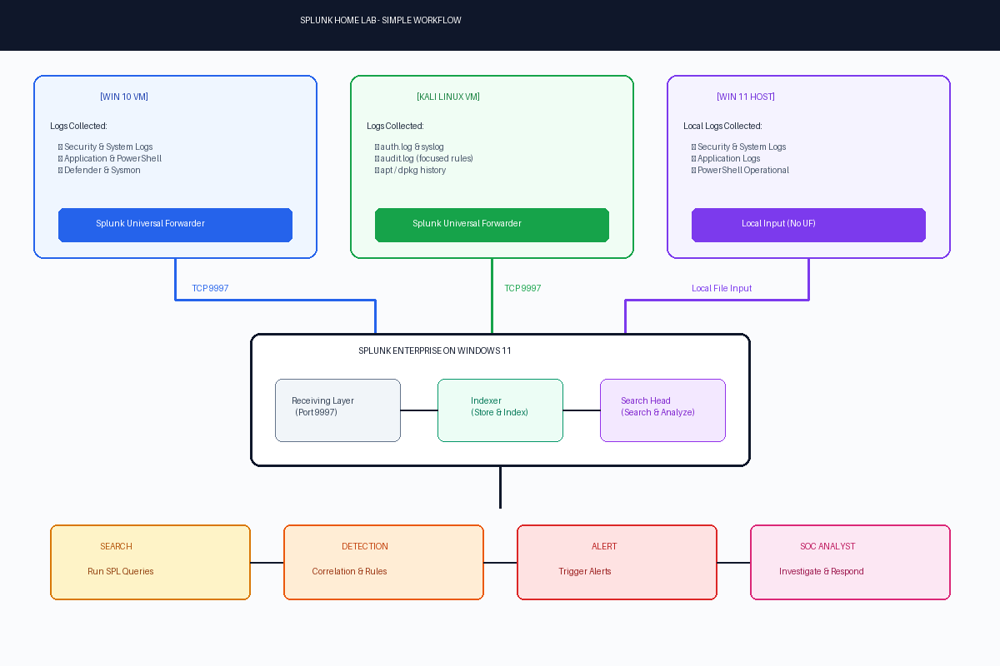
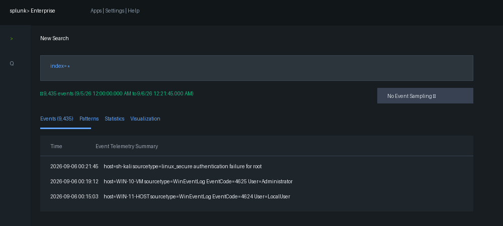
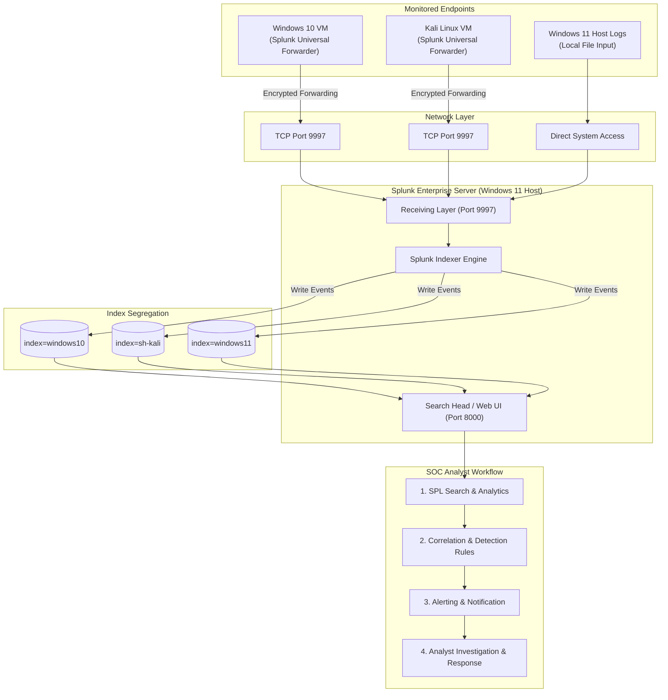
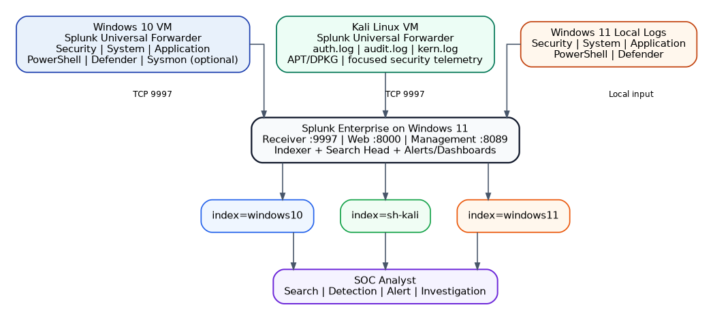

# 🛡️ Splunk SOC Home Lab: Centralized Windows & Linux Security Monitoring

[](https://www.splunk.com/)
[](https://www.microsoft.com/windows)
[](https://www.microsoft.com/windows)
[](https://www.kali.org/)
[](LICENSE)

> A hands-on, multi-OS Security Operations Center (SOC) home laboratory implementing centralized log ingestion, security telemetry forwarding, index segregation, SPL detection engineering, and incident response workflows using **Splunk Enterprise 10.4.2** and **Splunk Universal Forwarders**.

---

## 📸 Executive Summary & Visual Workflow

This repository documents the end-to-end architecture, configuration, and detection capabilities of a centralized Security Information and Event Management (SIEM) environment. The Splunk Enterprise server running on a **Windows 11 Host** acts as a central receiving, indexing, search, alerting, and analysis node. Heterogeneous log telemetry is forwarded near real-time over **TCP 9997** from a **Windows 10 VM** and a **Kali Linux VM** alongside local Windows 11 host logs.



### 📊 Live Splunk Ingestion Verification
Below is a snapshot from the Splunk Enterprise Search & Reporting interface showing **9,435+ events** successfully ingested across all configured indices (`index=*`):



---

## 📋 Table of Contents

- [🛡️ Splunk SOC Home Lab: Centralized Windows \& Linux Security Monitoring](#️-splunk-soc-home-lab-centralized-windows--linux-security-monitoring)
  - [📸 Executive Summary \& Visual Workflow](#-executive-summary--visual-workflow)
    - [📊 Live Splunk Ingestion Verification](#-live-splunk-ingestion-verification)
  - [📋 Table of Contents](#-table-of-contents)
  - [🎯 Objectives \& Project Scope](#-objectives--project-scope)
  - [🏗️ Lab Architecture \& Data Flow](#️-lab-architecture--data-flow)
    - [Mermaid Interactive Topology](#mermaid-interactive-topology)
    - [Data Ingestion Architecture Diagram](#data-ingestion-architecture-diagram)
  - [🌐 Network Infrastructure \& Port Matrix](#-network-infrastructure--port-matrix)
  - [🗂️ Index \& Telemetry Mapping](#️-index--telemetry-mapping)
  - [⚙️ Setup \& Implementation Guide](#️-setup--implementation-guide)
    - [Phase 1: Windows 11 Splunk Enterprise Receiver Setup](#phase-1-windows-11-splunk-enterprise-receiver-setup)
    - [Phase 2: Windows 11 Local Log Collection](#phase-2-windows-11-local-log-collection)
    - [Phase 3: Windows 10 VM Universal Forwarder Setup](#phase-3-windows-10-vm-universal-forwarder-setup)
    - [Phase 4: Kali Linux VM Universal Forwarder \& Audit Tuning](#phase-4-kali-linux-vm-universal-forwarder--audit-tuning)
  - [🔍 Verification \& SPL Search Queries](#-verification--spl-search-queries)
  - [🚨 SOC Detection Use Cases](#-soc-detection-use-cases)
  - [🛠️ Troubleshooting \& Engineering Notes](#️-troubleshooting--engineering-notes)
  - [🔒 Security \& Operational Best Practices](#-security--operational-best-practices)
  - [✅ Project Validation Checklist](#-project-validation-checklist)
  - [🚀 Future Enhancements \& Roadmap](#-future-enhancements--roadmap)
  - [📁 Repository Directory Layout](#-repository-directory-layout)

---

## 🎯 Objectives & Project Scope

- **Centralized SIEM Deployment**: Build a centralized SIEM infrastructure using Splunk Enterprise 10.4.2 on a Windows 11 host.
- **Cross-Platform Telemetry Collection**: Forward Windows Event Logs (Security, System, Application, PowerShell, Defender) from Windows 10 and Linux security telemetry (`auth.log`, `auditd`, `kern.log`, `apt/dpkg`) from Kali Linux.
- **Index Segregation & Data Hygiene**: Create dedicated indexes (`windows11`, `windows10`, `sh-kali`) to isolate system telemetry and streamline investigation workflows.
- **Linux Audit Noise Optimization**: Fine-tune Linux `auditd` rules to eliminate excessive syscall noise while preserving high-fidelity File Integrity Monitoring (FIM) and credential modification alerts.
- **Detection Engineering & SPL Practice**: Develop Splunk Processing Language (SPL) queries to identify brute-force logons, privilege escalation, unauthorized account creation, and sensitive configuration tampering.

---

## 🏗️ Lab Architecture & Data Flow

### Mermaid Interactive Topology



### Data Ingestion Architecture Diagram



---

## 🌐 Network Infrastructure & Port Matrix

| System / Device | Role | IP Addressing | Routing / Subnet Notes |
| :--- | :--- | :--- | :--- |
| **Windows 11 Host** | Central SIEM Server (Splunk Enterprise) | `<Splunk_Server_IP>` | Host Network (Local Listener) |
| **Windows 10 VM** | Monitored Windows Endpoint | Dynamic / VM Subnet | Routed/NAT to `<Splunk_Server_IP>` |
| **Kali Linux VM** | Monitored Linux Endpoint | `192.168.X.X/24` | Hypervisor NAT Gateway to Host |

### Service Port Map

| Port | Protocol | Source -> Destination | Description / Purpose |
| :---: | :---: | :--- | :--- |
| **8000** | TCP | Analyst Browser -> Windows 11 Host | Splunk Web User Interface |
| **8089** | TCP | Management CLI -> Splunk Server | Splunk REST API & Management Service |
| **9997** | TCP | Universal Forwarders -> Windows 11 Host | Splunk-to-Splunk Ingestion Receiver Port |

---

## 🗂️ Index & Telemetry Mapping

To prevent data cross-contamination and accelerate SPL query performance, telemetry is structured into three primary indexes:

| Index Name | Source Machine | Ingested Log Channels / Files | Primary Sourcetypes |
| :--- | :--- | :--- | :--- |
| `windows11` | Windows 11 Host | Security, System, Application, PowerShell, Defender | `WinEventLog:Security`, `WinEventLog:System`, etc. |
| `windows10` | Windows 10 VM | Security, System, Application, PowerShell, Defender, Sysmon | `WinEventLog:Security`, `XmlWinEventLog:Sysmon` |
| `sh-kali` | Kali Linux VM | `/var/log/auth.log`, `/var/log/audit/audit.log`, `kern.log`, `apt/dpkg` | `linux_secure`, `linux_audit`, `linux_kernel`, `dpkg`, `apt_history` |

---

## ⚙️ Setup & Implementation Guide

### Phase 1: Windows 11 Splunk Enterprise Receiver Setup

1. **Install Splunk Enterprise**: Run the installer `splunk-10.4.2-x64-release.msi` on Windows 11 and launch Splunk Web at `http://localhost:8000`.
2. **Enable Receiving Listener**:
   - Navigate to **Settings** -> **Forwarding and receiving** -> **Configure receiving**.
   - Add new receiving port: `9997`.
   - *CLI Alternative*:
     ```cmd
     cd "C:\Program Files\Splunk\bin"
     splunk enable listen 9997 -auth admin:<password>
     ```
3. **Configure Windows Firewall**:
   Open PowerShell as Administrator and create an inbound rule allowing TCP 9997:
   ```powershell
   New-NetFirewallRule -DisplayName "Splunk Forwarder 9997" -Direction Inbound -Protocol TCP -LocalPort 9997 -Action Allow
   Get-NetTCPConnection -LocalPort 9997 -State Listen
   ```

### Phase 2: Windows 11 Local Log Collection

Because Splunk Enterprise runs locally on Windows 11, local inputs are defined in `inputs.conf` without needing a Universal Forwarder agent:

📁 Configuration file: [`configs/windows11/inputs.conf`](configs/windows11/inputs.conf)

```ini
[WinEventLog://Security]
disabled = 0
index = windows11

[WinEventLog://System]
disabled = 0
index = windows11

[WinEventLog://Application]
disabled = 0
index = windows11

[WinEventLog://Microsoft-Windows-PowerShell/Operational]
disabled = 0
index = windows11

[WinEventLog://Microsoft-Windows-Windows Defender/Operational]
disabled = 0
index = windows11
```

### Phase 3: Windows 10 VM Universal Forwarder Setup

1. **Install Universal Forwarder**: Download and install Splunk Universal Forwarder on the Windows 10 VM.
2. **Configure Target Server**:
   ```cmd
   cd "C:\Program Files\SplunkUniversalForwarder\bin"
   .\splunk.exe add forward-server <Splunk_Server_IP>:9997
   .\splunk.exe list forward-server
   ```
3. **Define Ingestion Channels**:

📁 Configuration file: [`configs/windows10/inputs.conf`](configs/windows10/inputs.conf)

```ini
[WinEventLog://Security]
disabled = 0
index = windows10

[WinEventLog://System]
disabled = 0
index = windows10

[WinEventLog://Application]
disabled = 0
index = windows10

[WinEventLog://Microsoft-Windows-PowerShell/Operational]
disabled = 0
index = windows10

[WinEventLog://Microsoft-Windows-Windows Defender/Operational]
disabled = 0
index = windows10
```

#### High-Value Windows Security Event IDs Monitored

| Event ID | Description & SOC Relevance |
| :---: | :--- |
| **4624** | Successful User Authentication / Logon |
| **4625** | Failed User Authentication (Brute force indicator) |
| **4648** | Logon attempted using explicit credentials (`runas`) |
| **4672** | Special privileges assigned to new logon (`Administrator`) |
| **4688** | New Process Creation (Command line auditing) |
| **4720** | User Account Created |
| **4726** | User Account Deleted |
| **4732** | Member added to local Security Group (e.g. Administrators) |
| **4740** | User Account Lockout |
| **7045** | Service Created / Installed (Persistence mechanism) |

---

### Phase 4: Kali Linux VM Universal Forwarder & Audit Tuning

1. **Install Splunk Universal Forwarder Package**:
   ```bash
   wget -O splunkforwarder-10.4.2-linux-amd64.deb "https://download.splunk.com/products/universalforwarder/releases/10.4.2/linux/splunkforwarder-10.4.2-33c3bf42cd73-linux-amd64.deb"
   sudo dpkg -i splunkforwarder-10.4.2-linux-amd64.deb
   ```
2. **Enable Forwarder & Network Binding**:
   ```bash
   sudo /opt/splunkforwarder/bin/splunk start --accept-license
   sudo /opt/splunkforwarder/bin/splunk enable boot-start
   sudo /opt/splunkforwarder/bin/splunk add forward-server <Splunk_Server_IP>:9997
   ```
3. **Setup `rsyslog` for Auth Telemetry**:
   Kali Linux default installations use `systemd-journald` without writing to `/var/log/auth.log`. Install `rsyslog` to populate auth logs:
   ```bash
   sudo apt update && sudo apt install rsyslog -y
   sudo systemctl enable --now rsyslog
   ```
4. **Deploy Noise-Controlled `auditd` Rules**:
   Broad `execve` auditing generates thousands of unwanted system calls. We deploy targeted audit rules for critical files and persistence points:

📁 Configuration file: [`configs/kali/audit.rules`](configs/kali/audit.rules)

```ini
# Account database changes
-w /etc/passwd -p wa -k account_changes
-w /etc/shadow -p wa -k account_changes
-w /etc/group -p wa -k account_changes
-w /etc/gshadow -p wa -k account_changes

# Privilege configuration
-w /etc/sudoers -p wa -k sudo_changes
-w /etc/sudoers.d/ -p wa -k sudo_changes

# SSH and persistence configuration
-w /etc/ssh/sshd_config -p wa -k ssh_config_changes
-w /etc/crontab -p wa -k cron_changes
-w /etc/cron.d/ -p wa -k cron_changes

# User directory File Integrity Monitoring (FIM)
-w /home/sh-kali/Desktop/ -p wa -k user_file_changes
```
Apply rules:
```bash
sudo augenrules --load
sudo auditctl -l
```

5. **Configure Kali `inputs.conf`**:

📁 Configuration file: [`configs/kali/inputs.conf`](configs/kali/inputs.conf)

```ini
[monitor:///var/log/auth.log]
disabled = false
index = sh-kali
sourcetype = linux_secure

[monitor:///var/log/audit/audit.log]
disabled = false
index = sh-kali
sourcetype = linux_audit

[monitor:///var/log/kern.log]
disabled = false
index = sh-kali
sourcetype = linux_kernel

[monitor:///var/log/dpkg.log]
disabled = false
index = sh-kali
sourcetype = dpkg

[monitor:///var/log/apt/history.log]
disabled = false
index = sh-kali
sourcetype = apt_history
```

---

## 🔍 Verification & SPL Search Queries

Execute the following Splunk Processing Language (SPL) queries in Splunk Web to verify data ingestion and host connectivity:

### 1. Host and Index Health Audit
```spl
index=* 
| stats count by host index sourcetype 
| sort - count
```

### 2. Monitor Forwarder Event Breakdown
```spl
index=* 
| stats count by host source
```

### 3. Windows Failed Authentication Tracking
```spl
index=windows10 EventCode=4625 
| stats count by TargetUserName, WorkstationName, src_ip, _time 
| sort - _time
```

### 4. Linux Security Authentication Failures (`sudo` / `su`)
```spl
index=sh-kali sourcetype=linux_secure "authentication failure" 
| table _time, host, process, message
```

### 5. Linux Auditd File Integrity Monitoring (FIM)
```spl
index=sh-kali sourcetype=linux_audit (key="account_changes" OR key="user_file_changes" OR key="sudo_changes") 
| table _time, host, key, name, exe, auid
```

---

## 🚨 SOC Detection Use Cases

| Detection ID | Use Case Name | Target Data Source | SPL Detection Logic / Threshold |
| :---: | :--- | :--- | :--- |
| **SOC-DET-01** | Windows Brute Force Attempt | `index=windows10 EventCode=4625` | `index=windows10 EventCode=4625 \| stats count by TargetUserName, host \| where count >= 5` |
| **SOC-DET-02** | Unauthorized Account Creation | `index=windows10 EventCode=4720` | `index=windows10 EventCode=4720 \| table _time, TargetUserName, SubjectUserName` |
| **SOC-DET-03** | Linux Account Database Modification | `index=sh-kali sourcetype=linux_audit` | `index=sh-kali sourcetype=linux_audit key="account_changes" \| table _time, exe, name, auid` |
| **SOC-DET-04** | Failed Sudo Privilege Escalation | `index=sh-kali sourcetype=linux_secure` | `index=sh-kali sourcetype=linux_secure "COMMAND=" "authentication failure"` |
| **SOC-DET-05** | Sensitive File Modification / FIM | `index=sh-kali sourcetype=linux_audit` | `index=sh-kali sourcetype=linux_audit key="user_file_changes"` |

---

## 🛠️ Troubleshooting & Engineering Notes

| Problem Identified | Root Cause | Engineering Resolution |
| :--- | :--- | :--- |
| **PowerShell Access Denied** | Insufficient user privileges | Launch PowerShell using **"Run as Administrator"**. |
| **Kali `nc` inverse host lookup warning** | Missing reverse DNS entry for `<Splunk_Server_IP>` | Harmless warning; verify port status reports `open`. |
| **Forwarder Active Status Inactive** | Firewall blocking port 9997 or service stopped | Confirm `Get-NetTCPConnection -LocalPort 9997` and verify host firewall rule. |
| **Missing `/var/log/auth.log` on Kali** | Systemd journald default behavior | Install and enable `rsyslog` service (`sudo apt install rsyslog`). |
| **High `auditd` Event Flooding** | Broad `-a always,exit -S execve` rule | Remove global syscall auditing and enforce targeted rule keys (`-k account_changes`). |

---

## 🔒 Security & Operational Best Practices

1. **Network Segmentation**: Isolate laboratory virtual machines using Host-Only or NAT network adapters. Avoid exposing TCP port 9997 to public IP interfaces.
2. **Firewall Scoping**: Restrict inbound firewall rules on port 9997 to explicit VM subnets (`192.168.X.X/24`) rather than `Any`.
3. **Credential Security**: Never hardcode administrator passwords or API session keys in `inputs.conf` files or public repositories.
4. **Time Synchronization**: Ensure NTP services are active across Windows 11 host and virtual machines to prevent timeline skew during SOC investigations.
5. **Index Scoping**: Always specify `index=` in SPL queries to minimize search head memory consumption.

---

## ✅ Project Validation Checklist

- [x] Splunk Enterprise 10.4.2 accessible via web browser at `http://localhost:8000`.
- [x] Splunk Receiver active and listening on `TCP 9997`.
- [x] Windows Firewall inbound rule configured for `TCP 9997`.
- [x] Windows 10 VM Universal Forwarder actively shipping events to `index=windows10`.
- [x] Kali Linux VM Universal Forwarder actively shipping events to `index=sh-kali`.
- [x] `rsyslog` installed on Kali Linux to generate `/var/log/auth.log`.
- [x] Targeted `auditd` rules deployed without system event noise.
- [x] Local Windows 11 host events ingested into `index=windows11`.
- [x] Over **9,435+ total events** ingested and validated via `index=*`.
- [x] SPL queries created for failed logons, account creation, and FIM alerts.

---

## 🚀 Future Enhancements & Roadmap

- [ ] **Sysmon Integration**: Deploy Microsoft System Monitor (Sysmon) on Windows 10/11 with SwiftOnSecurity / Olaf Hartong configuration.
- [ ] **Network Threat Telemetry**: Integrate Suricata / Zeek NIDS to forward packet inspection logs to Splunk.
- [ ] **Active Directory Domain Controller**: Add a Windows Server 2022 AD VM to capture Kerberos ticket requests (AS-REP Roasting / Kerberoasting).
- [ ] **MITRE ATT&CK Mapping**: Map custom Splunk detection alerts to MITRE ATT&CK framework technique IDs.
- [ ] **Interactive SOC Dashboards**: Build custom XML/JSON dashboards visualising authentication trends and threat maps.

---

## 📁 Repository Directory Layout

```
.
├── README.md                                  # Comprehensive Project Documentation
├── extract_media.ps1                          # Utility Script to extract DOCX assets
├── configs/                                   # Splunk & OS Configuration Files
│   ├── windows11/
│   │   └── inputs.conf                        # Windows 11 Host Local Inputs
│   ├── windows10/
│   │   └── inputs.conf                        # Windows 10 VM Universal Forwarder Inputs
│   └── kali/
│       ├── inputs.conf                        # Kali Linux Universal Forwarder Inputs
│       └── audit.rules                        # Noise-controlled auditd rules
└── docs/                                      # Project Artifacts & Screenshots
    ├── Splunk_SOC_Home_Lab_Project_Report.docx# Full Academic/Technical Project Report
    └── images/
        ├── workflow_diagram.png               # High-level SOC Ingestion Workflow Diagram
        ├── architecture_diagram.png           # Multi-OS Network & Index Topology
        ├── splunk_search_events.png           # Splunk Web UI Search Ingestion Proof
        └── pipeline_flow.png                  # Splunk Pipeline Data Flow Component Diagram
```

---

*Project Created & Maintained for SOC Analysis & Detection Engineering Learning.*
